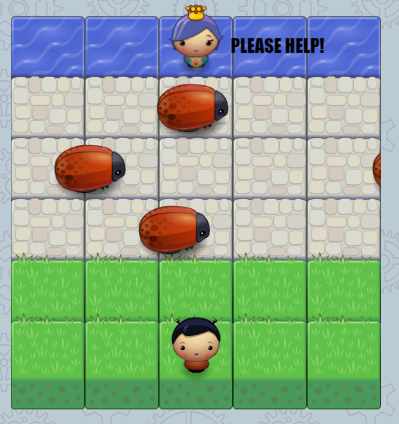

frontend-nanodegree-arcade-game (Udacity FEND project)
===============================
# Game Functionality:
 * The player can move on the grid by either using the arrows or the A S D W keys.
 * The player cannot move beyond the grid.
 * When the player collides with a bug he is reseted to his original position.
 * The game is won once the player reaches the water.
---
### Click [here](https://userrrfriendly.github.io/frontend-nanodegree-arcade-game/) to play the game, alternatively if you want to play it locally you have to download it (click the 'clone or download' button to download the game) and open the index.html file. 
---
### Built with JavaScript and HTML5 canvas. The only dependancies are the (already included in the js directory) engine.js & resources.js
---
#### Sample Screenshot

---
